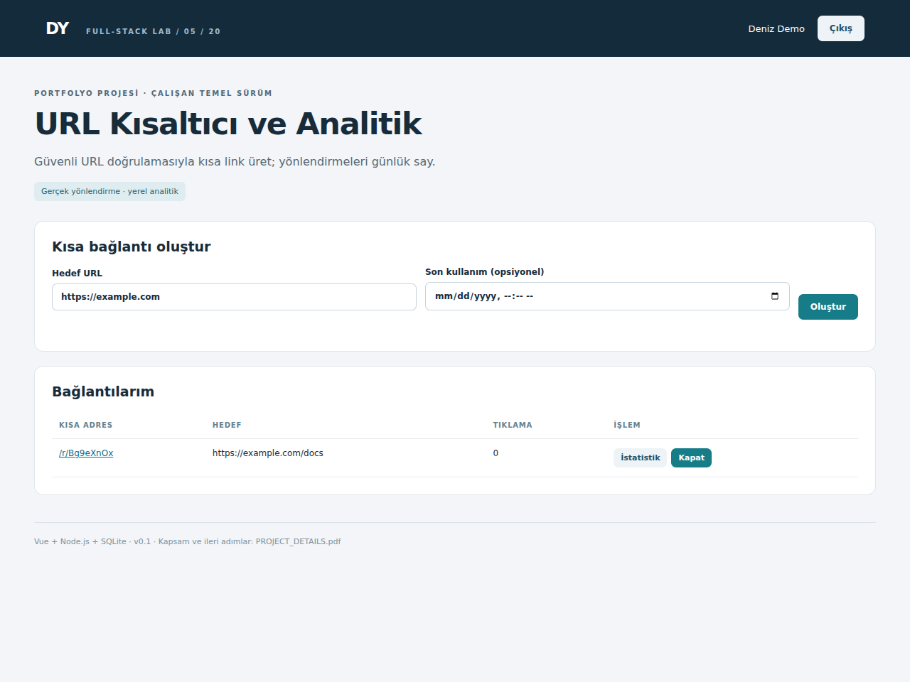

# URL Kısaltıcı ve Analitik

Güvenli URL doğrulamasıyla kısa link üret; yönlendirmeleri günlük say.



**Durum:** Çalıştırılabilir yerel temel sürüm (v0.1). Gerçek yönlendirme · yerel analitik.

## Kurulum

Node.js 24.x ve npm gerekir. İlk kurulumda npm paketlerini indirmek için internet bağlantısı gerekir. Node 24 `node:sqlite` deneysel uyarısı yazabilir; bu uyarı tek başına hata değildir.

```bash
npm ci
npm run dev
```

Tarayıcı: http://localhost:3000. Giriş: **demo@example.com / Demo12345!**. İkinci hesap: **other@example.com / Demo12345!**.

İkinci terminalde, aynı proje klasöründe:

```bash
npm run seed
```

Seed komutu örnek kayıt ekler; tekrar çalıştırmak yeni örnek kayıtlar oluşturabilir. Bazı projelerde başlangıç kataloğu zaten hazırdır; seed bunu açıklar.

## Derleme ve test

```bash
npm test
npm run typecheck
npm run build
npm start
```

`npm run dev` sırasında değişiklikleri Vite işler. `npm start` için önce build gerekir. Testler RAM veritabanı ve rastgele portla çalışır; kendi verilerini oluşturur. Mevcut demo veritabanını değiştirmez. Typecheck TypeScript giriş/ortak bileşenlerini ve Vue şablonlarını kapsar; JavaScript backend'in tam tip doğrulaması değildir.

## Çalışan özellikler

- HTTP/HTTPS URL kontrolü
- Rastgele base64url kısa kod
- 302 ve no-store yönlendirme
- Son kullanım ve kapatma
- Günlük tıklama toplamı

## Kapsam sınırı

Kod üretimi Base62 değil base64url kullanır. QR, konum, cihaz sınıfı, bot ayrımı ve benzersiz ziyaretçi metriği yok. Linkler yönlendirme içindir; hedef içerik sunucudan indirilmez.

## Dosyalar ve akış

| Dosya | Sorumluluk |
| --- | --- |
| client/Workspace.vue | Projeye özel formlar, listeler, kullanıcı eylemleri |
| client/App.vue | Oturum açma ve ortak sayfa düzeni |
| client/api.ts | Fetch, hata mesajı, para/tarih yardımcıları |
| server/project.js | Alan kuralları, SQL sorguları ve API uçları |
| server/core.js | Veritabanı, doğrulama, oturum ve SSE yardımcıları |
| server/index.js | Express başlatma, güvenlik başlıkları ve statik dosyalar |
| schema.sql | Uygulamanın gerçek tablo/indeks şeması; referans amaçlı |
| tests/project.test.js | Gerçek HTTP istekleriyle kritik iş kuralları |
| scripts/seed.js | Örnek veri ekleme |
| PROJECT_DETAILS.pdf | Beş sayfalık proje açıklaması, API, test ve geliştirme rehberi |

Arayüz → aynı origin `/api` → oturum/sahiplik/doğrulama → iş kuralı → SQLite → JSON → görünüm. SQLite `data/app.sqlite` dosyasında kalıcıdır. Bu küçük uygulamalarda tablolar açılışta `CREATE TABLE IF NOT EXISTS` ile kurulur; sürümlü migration sistemi henüz yoktur.

## İş kuralı

Kısa kod kriptografik rastgele 6 bayttan üretilir. DB UNIQUE çakışmayı engeller ve kod yeniden denenir. Tıklama her başarılı yönlendirmede eklenir; ham IP saklanmaz. Cache-Control no-store tarayıcı önbelleğinin sayımı atlamasını azaltır. Süresi dolan veya kapalı bağlantı 410 döner.

## API haritası

Oturum: `POST /api/auth/login` JSON `{"email":"demo@example.com","password":"Demo12345!"}`; `GET /api/auth/me`; `POST /api/auth/logout`. Çerez HttpOnly + SameSite=Strict. Tarayıcı aynı origin kullanır.

| Yöntem ve yol | Girdi | Başarı |
| --- | --- | --- |
| POST /api/links | JSON: target, expires | 201 |
| GET /api/links | Gövde yok | 200 |
| PATCH /api/links/:id | JSON: enabled | 200 |
| GET /api/links/:id/stats | Gövde yok | 200 |
| GET /r/:code | Gövde yok | 302 / 410 |

Uç nokta gövdelerinin somut örnekleri `tests/project.test.js` ve `scripts/seed.js` içinde bulunur. `:id` alanlarını önceki oluşturma yanıtından al. Hatalar JSON `{"error":"açıklama"}` biçimindedir; 401 giriş, 403 rol/origin, 404 kayıt/sahiplik, 409 çakışma, 422 doğrulama, 429 kota anlamına gelir. Listeler küçük yerel demo kapsamındadır; tümünde sayfalama yoktur.

```text
POST /api/links
{"target":"https://example.com/docs","expires":null}
201 {"id":"<link-id>","code":"...","shortPath":"/r/..."}
```

## Kabul senaryoları

- [ ] javascript: adresi reddedilmeli.
- [ ] Açılan link 302 ve doğru Location döndürmeli.
- [ ] Başarılı açılış sonrası sayaç artmalı.
- [ ] Kapalı link 410, yabancı kullanıcı istatistikte 404 almalı.

## İlk gün yapacağın çalışma

Link oluştur ve aç. Network panelinde 302 Location başlığını, panelde artan sayıyı kontrol et. Linki kapatıp 410 yanıtını gözle.

## Sonraki geliştirmeler

- [ ] QR üretimi ekle
- [ ] Kötüye kullanım raporlama ekle
- [ ] Redis cache geçersizleştirme tasarla
- [ ] Tıklama yazımını kuyrukla ayır

## GitHub sunumu

Önce kurulumu çalıştır, testleri oku ve en az bir davranışı kendin geliştir. Her gün yaptığın gerçek değişikliği açıklayan commit at. `feat: ...`, `fix: ...`, `test: ...`, `docs: ...` örnek öneklerdir. `docs/screenshot.png` başlangıç sürümünün ekranıdır; değişikliklerinden sonra kendi ekranınla güncelle.

`.gitignore`, node_modules, dist, data ve .env dosyalarını dışarıda bırakır. Veritabanını, anahtarları veya gerçek müşteri/aday belgelerini GitHub'a koyma. GitHub repo oluşturma/yükleme bu paket tarafından otomatik yapılmaz.

## Ortam ayarları

`.env.example` dosyasını `.env` olarak kopyala; dosya varsayılan npm komutlarında otomatik okunmaz. Kullanmak için `node --env-file=.env server/index.js --dev`. PORT varsayılan 3000, HOST 127.0.0.1, DB_PATH data/app.sqlite. DEMO_PASSWORD yalnız yeni veritabanında hesap oluşturulurken kullanılır; var olan parolayı değiştirmez. COOKIE_SECURE yalnız HTTPS ortamında 1 olmalı. Farklı projeleri aynı anda çalıştırırken farklı PORT kullan.

## Dağıtım notu

Bu sürüm yerel portfolyo/öğrenme içindir. Genel internete açmadan önce demo hesaplarını kaldırıp kayıt/parola sıfırlama ve gerçek kullanıcı yaşam döngüsü ekle. Tek süreç/senkron SQLite yaklaşımı yoğun trafikli hizmet için hedef mimari değildir. PostgreSQL geçişinde SQL tipleri, transaction sınırları, indeksler, migration ve yedeklemeyi ayrıca tasarla. Dockerfile genel Node uygulaması içindir; Docker runner ve FFmpeg gibi özel bağımlılıklar otomatik kurulmaz.

## Mülakat provası

Yönlendirmeyi tarayıcı cache ederse tıklama metriği nasıl değişir? Rastgele kod ile hash arasındaki fark nedir?

## Lisans

MIT; bağımlılıkların kendi lisansları saklıdır.
